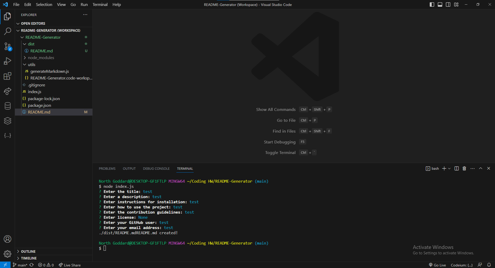

# README-Generator

## Table of Contents 

- [Description](#description)
- [Images](#images)
- [Link](#link)
- [Creator](#creator)

## Description

This project uses Node.js to create a ReadME generator. By answering simple questions about your project this application can quickly create a well put together readme for your project.

## Images

## Link

## Creator

- North Goddard (https://github.com/northgoddard)